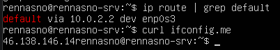
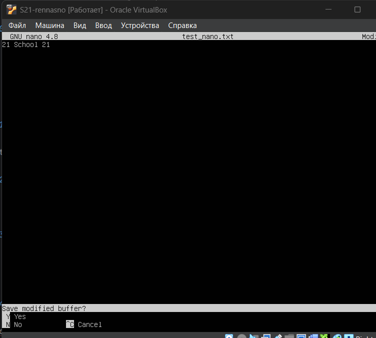
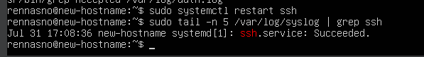

# Отчёт по выполнению заданий Linux

## Part 1
-   
  Вывод версии Ubuntu сразу после установки

## Part 2
-   
  Вывод наличия нового пользователя в /etc/passwd и команда создания

## Part 3
-   
  Изменение названия машины

-   
  Интерфейс lo (loopback) — виртуальный интерфейс для внутренних соединений (127.0.0.1)

-   
  DHCP — протокол автоматической настройки сетевых параметров

-   
  Внутренний шлюз и внешний IP

-   
  Изменение конфигурации сети

-   
  Тестирование подключения после перезагрузки

## Part 4
-   
  Команды apt update/upgrade для проверки и установки обновлений

## Part 5
-   
  Добавление пользователя в группу sudo и изменение hostname

## Part 6
-   
  Проверка текущей временной зоны

## Part 7
-   
  Сохранение и выход из Vim (:wq)

-   
  Сохранение в Nano (Ctrl+X → Y → Enter)

-   
  Сохранение в Joe (Ctrl+K → X)

-   
  Выход из Vim без сохранения (:q!)

-   
  Примеры поиска и замены текста в редакторах

## Part 8
-   
  Установка и настройка SSH-сервера на порту 2022

-   
  Вывод netstat -tan с пояснением параметров

## Part 9
-   
  Вывод top с ключевыми метриками системы

-   
  Различные варианты сортировки и фильтрации в htop

## Part 10
-   
  Параметры диска /dev/sda: размер, сектора, swap

## Part 11
-   
  Статистика использования корневого раздела (/)

## Part 12
-   
  Размеры папок в байтах и человекочитаемом виде

## Part 13
-   
  Анализ дискового пространства через ncdu

## Part 14
-   
  Просмотр журналов: dmesg, syslog, auth.log

-   
  Сообщения о перезапуске SSH-сервера

## Part 15
-   
  Добавление, проверка и удаление cron-заданий